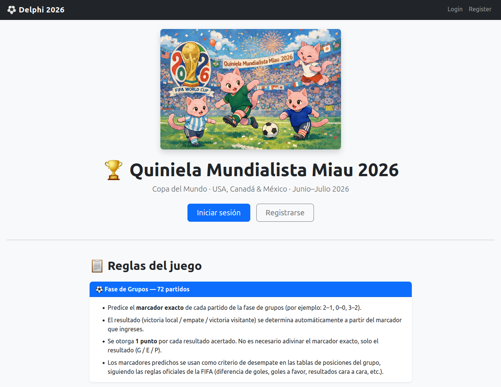
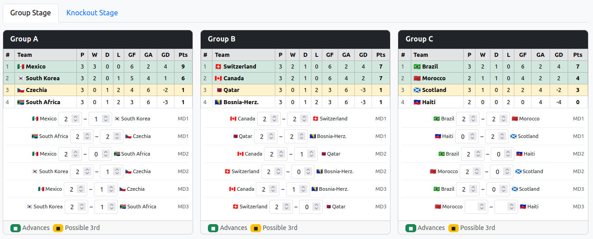
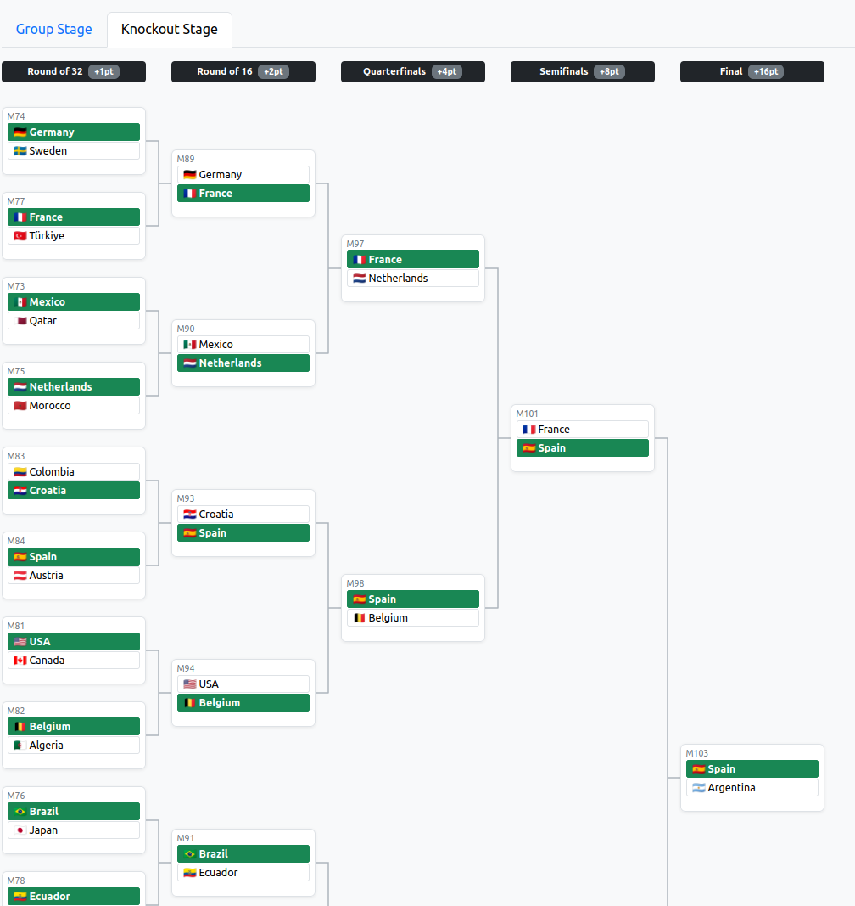

# Delphi — World Cup 2026 Prediction Pool

A private bracket pool web app for World Cup 2026, built for a group of ~30 friends. Users register with an invite code, predict every match result before the tournament starts, and earn points as real results come in. A live leaderboard tracks standings throughout the tournament.



## What it does

- **Registration** — invite-code gated, no email verification needed
- **Group stage predictions** — users enter exact scores (e.g. 2–1) for all 72 group matches; points are awarded for correct outcome (W/D/L), not exact score; predicted scores feed into FIFA tiebreaker calculations to determine group standings
- **Knockout bracket** — dynamically built from each user's group stage predictions; users click to pick the winner of each match from Round of 32 through the Final; points scale by round (1 → 2 → 4 → 8 → 16)
- **Round-based knockout scoring** — points are awarded if the picked team won in that round, regardless of which specific match slot they ended up in (important for WC2026's 48-team format where bracket paths vary)
- **Live leaderboard** — auto-refreshes every 60s; shows per-round point breakdown for each participant
- **Admin panel** — organiser enters actual results; scores update immediately





## Tech stack

| Layer | Technology |
|---|---|
| Backend | FastAPI (Python 3.12) |
| Templating | Jinja2 + HTMX |
| Styling | Bootstrap 5 |
| ORM | SQLAlchemy 2.0 (sync) |
| DB (dev) | SQLite |
| DB (prod) | PostgreSQL (Azure Flexible Server) |
| Auth | bcrypt + itsdangerous signed cookies |
| Migrations | Alembic |
| Hosting | Azure App Service + Azure PostgreSQL |

No JS framework — all interactivity is handled via HTMX partial swaps. Group score inputs auto-save on change and trigger a bracket reload via `HX-Trigger` headers.

## Running locally

```bash
cp .env.example .env       # set SECRET_KEY and INVITE_CODE
python3 -m venv .venv
source .venv/bin/activate
pip install -r requirements.txt
alembic upgrade head
uvicorn app.main:app --reload
```

Open http://localhost:8000, register at `/register` using the invite code.

## Deployment

Hosted on Azure App Service (B1) + Azure PostgreSQL Flexible Server (B1ms). See `INSTALL.md` for full step-by-step deployment instructions. CI/CD via GitHub Actions — merges to `main` deploy automatically.
